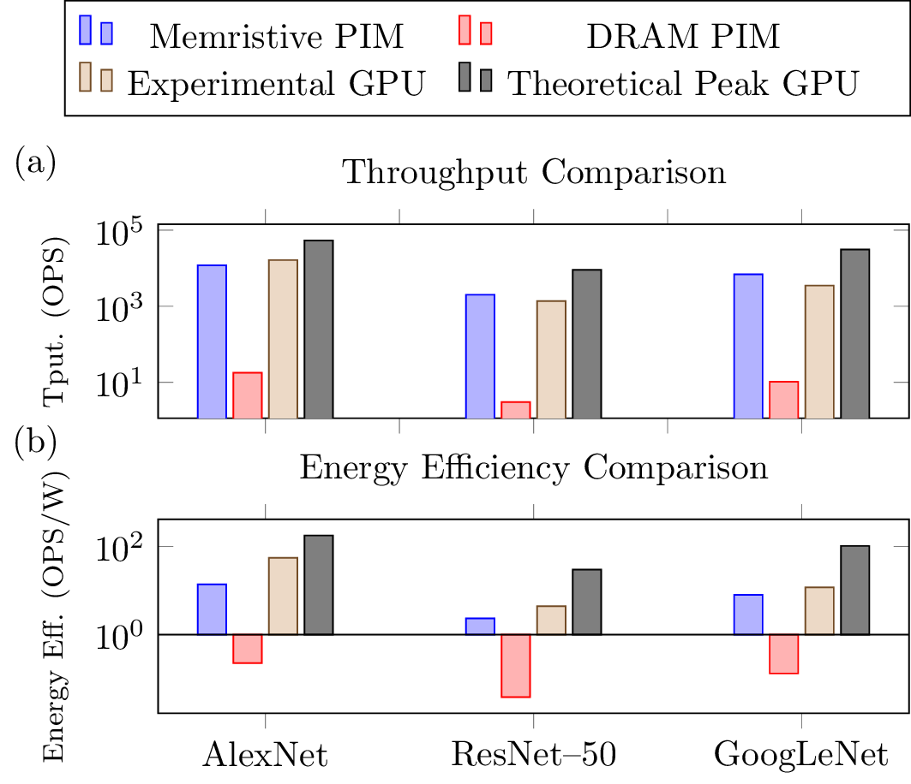
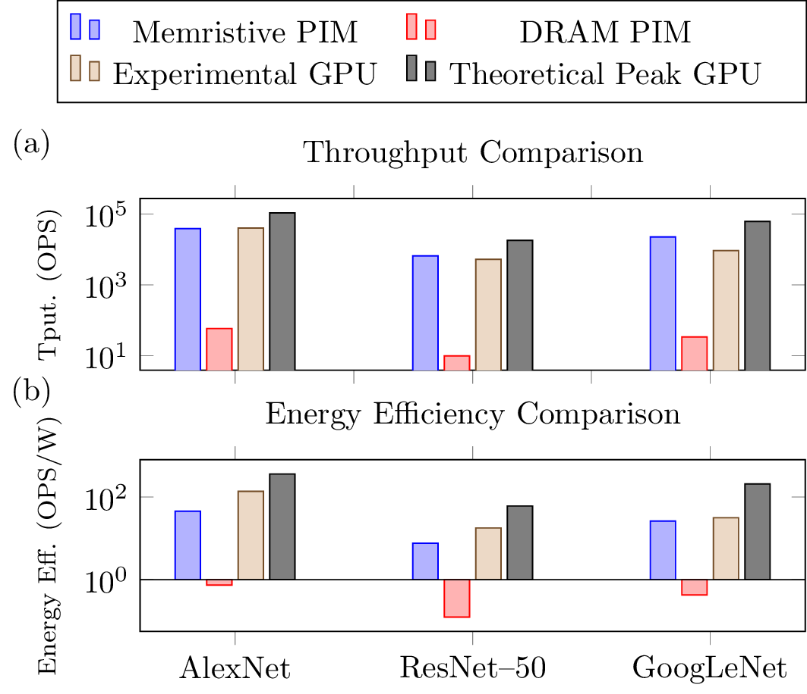

# ConvPIM: Evaluating Digital Processing-in-Memory through Convolutional Neural Network Acceleration
## Overview
This is the code repository for the following paper, 

`O. Leitersdorf, R. Ronen, and S. Kvatinsky, “ConvPIM: Evaluating Digital Processing-in-Memory through Convolutional Neural Network Acceleration,” 2023.`

The repository includes (1) a sensitivity analysis investigating the impact of several parameters on CNN acceleration, 
(2) further details on the evaluation methodology with the evaluation scripts, and (3) the raw results collected in ConvPIM. 

## Sensitivity Analysis

The goal of the sensitivity analysis is to evaluate the impact of the different evaluation parameters on the overall 
performance comparison. We evaluate (1) the impact of GPU selection by also evaluating the state-of-the-art NVIDIA A100 GPU,
(2) the impact of 16-bit floating-point quantization, and (3) the impact of the PIM row size on the PIM throughput.

We begin with the original CNN inference comparison presented in the manuscript (Figure 6) based on the NVIDIA A6000 GPU with 32-bit floating-point weights:

We consider the impact of performing CNN training rather than inference. We find that CNN training has approximately three times as many
operations as inference, yet we find similar GPU compute utilization throughout. Therefore, we expect the difference between PIM and experimental GPU
to remain approximately constant, as seen below:

We now evaluate the impact of the GPU selection by considering the NVIDIA A100 GPU. In contrast to the A6000 GPU, the A100 GPU
is designed for datacenter applications and is optimized for machine learning applications. This GPU is of significant interest as it 
has over double the memory bandwidth compared to the A6000 GPU. Therefore, as expected, we find that the gap between experimental 
and theoretical GPU shrinks slightly, as seen in the below figure evaluating A100 performance on 32-bit floating point numbers:

We shift to considering the impact of 16-bit floating-point quantization on the comparison. In this case, we expect
the GPU compute throughput to grow by 4x whereas the memory-bound performance only grows by 2x; therefore, we find that the 
gap between experimental and theoretical GPU grows slightly when comparing 16-bit floating-point CNNs on the A100:

Lastly, we evaluate the sensitivity of the PIM performance to the row size (while maintaining a fixed total memory size). We find that
increasing the row size decreases the number of rows in the memory, thereby decreasing the potential PIM parallelism and reducing 
the CNN throughput. Conversely, we find that the energy efficiency is independent of the row size as it depends only on the total number 
of gates performed. We find the following comparison of A6000 results when varying the row size for both memristive PIM and DRAM PIM architectures:

We further find the following results when varying only the memristive PIM row size:

Overall, we find that throughout the sensitivity analysis the PIM performance remains relatively on-par with GPU performance,
in contrast with previous works that demonstrated drastically improved performance.

## Methodology

The evaluation in this work consists of the PIM performance analysis and the GPU experiments. 

The PIM performance in the cases of 
arithmetic and matrix operations follow directly from the previous works of [AritPIM](https://github.com/oleitersdorf/AritPIM) and [MatPIM](https://github.com/oleitersdorf/MatPIM), respectively. Therefore, the correctness 
of the simulators in those works also proves the correctness of the PIM results in ConvPIM. Specifically, both the AritPIM and MatPIM simulators
are based on a format for cycle-accurate simulators that consists of three parts: (1) a simulator for a digital PIM architecture
that models the supported operations (e.g., NOR) directly, (2) an algorithm that generates a sequence of operations that are sent to the simulator,
and (3) a tester that executes the algorithm on the simulator and compares the generated output to a known ground-truth (e.g., CPU-based computation).
For the case of CNN inference and training, we develop a lower-bound on PIM performance based only on the matrix operations of matrix multiplication and convolution. 

The GPU results are gathered both from the official datasheets of the GPUs (NVIDIA A6000 48GB PCIe and NVIDIA A100 80GB PCIe) and from experiments performed
using the provided `PyTorch` scripts. Power consumption is sampled at fixed time intervals during the program execution via the `pynvml` bindings to `NVIDIA NVML` utility that records overall GPU power consumption, 
and we further gather additional GPU metrics (e.g., compute utilization, DRAM bandwidth, L1 hit rate) via the `NVIDIA Nsight Systems` profiler with GPU metrics enabled.

We include in the `results` folders several files with both the raw data presented in the above figures and additional collected metrics (i.e., using NVIDIA Nsight Systems). See below for further details on the organization.

## User Information
### Dependencies
The experimental GPU evaluation environment is implemented using `PyTorch` with bindings to `NVIDIA NVML` through `pynvml` for the power measurements. The scripts are further executed through the `NVIDIA Nsight Systems` profiler for additional profiler measurements.

### Organization
The repository is organized as follows:
- `README.md`: Provides general information on the evaluation of ConvPIM.
- `experiments`: Includes the `PyTorch` scripts that represent the different experiments in the paper.
- `results`: Contains (1) the raw outputs generated by the PyTorch scripts on both the A100 and A6000 GPUs and (2) spreadsheets that collate the results for easy comparison and further metrics. The `A6000_Results.csv` includes all the metrics collected in ConvPIM,
whereas `A100_Results_16bit.xlsx` and `A100_Results_32bit.xlsx` include the metrics collected for the above sensitivity analysis. 